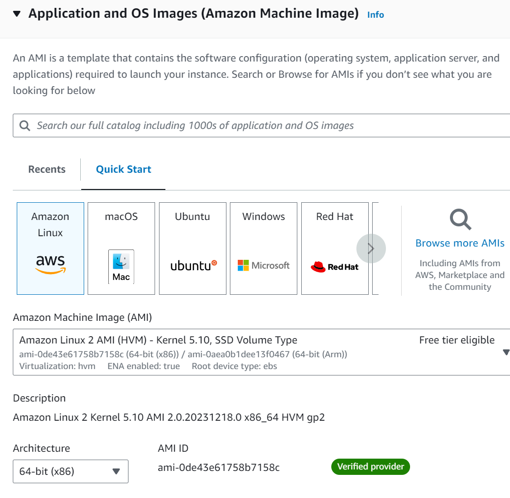
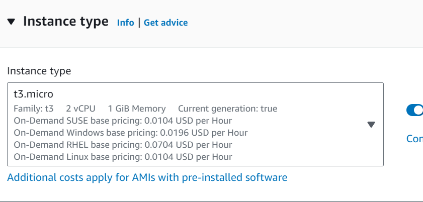
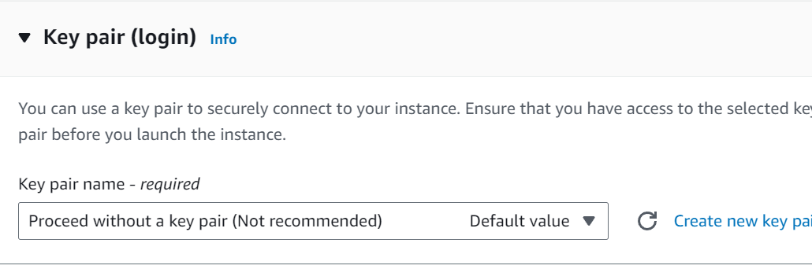
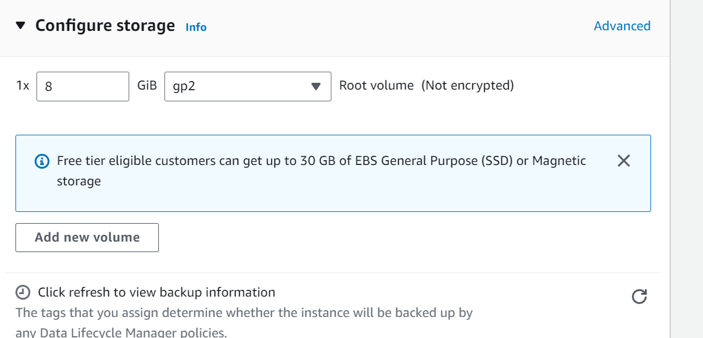
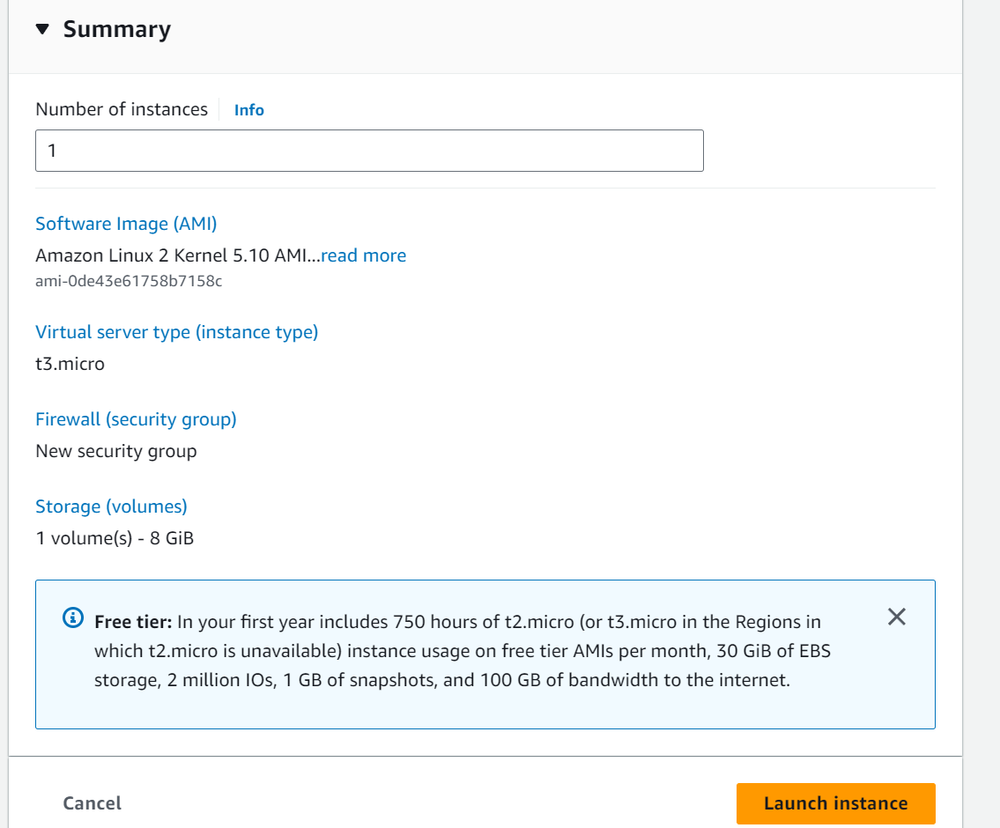
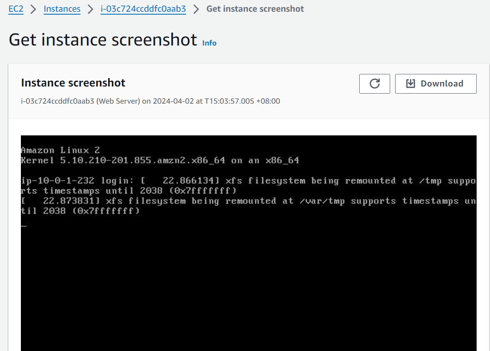

## Launching, Configuring, Monitoring Instance

1) Firstly, we have to name our instance. AWS creates a key-value pair. The key for this pair is Name, and the value is the name we enter for our EC2 instance.

<p align="center">
  
</p>
<p align="center"><b><i>Figure 1: Choose Name and Tags</i></b></p>

2) Secondly, we have to choose an AMI which provides the information required to launch an instance, which is a virtual server in the cloud.

<p align="center">
  
</p>
<p align="center"><b><i>Figure 2: Choose an AMI</i></b></p>

3) Thirdly, we have to select the instance type. Amazon EC2 provides a wide selection of instance types optimized to fit different use cases. Instance types comprise varying combinations of CPU, memory, storage, and networking capacity and give you the flexibility to choose the appropriate mix of resources for your applications. Each instance type includes one or more instance sizes so that you can scale your resources to the requirements of your target workload. This instance type has 2 virtual CPU and 1 GiB of memory.

<p align="center">
  
</p>
<p align="center"><b><i>Figure 3: Choose an Instance Type</i></b></p>

4) Fourthly, Configuring a key pair. Amazon EC2 uses public–key cryptography to encrypt and decrypt login information. To log in to our instance, we must create a key pair, specify the name of the key pair when we launch the instance, and provide the private key when we connect to the instance.

<p align="center">
  
</p>
<p align="center"><b><i>Figure 4: Configure a Key Pair</i></b></p>

5) Fifthly, Amazon EC2 stores data on a network-attached virtual disk called Amazon Elastic Block Store (Amazon EBS).

<p align="center">
  
</p>
<p align="center"><b><i>Figure 5: Add Storage</i></b></p>

6) Sixthly, we configure the details under Advanced details pane. When you launch an instance in Amazon EC2, you have the option of passing user data to the instance. These commands can be used to perform common automated configuration tasks and even run scripts after the instance starts.

The script does the following:

```bash
#!/bin/bash

# Install Apache web server
yum -y install httpd

# Configure the web server to automatically start on boot
systemctl enable httpd

# Activate the Web server
systemctl start httpd

# Create a simple web page
echo '<html>Hello From Your Web Server!</html>' > /var/www/html/index.html

7) Seventhly, we launch the instance.
<p align="center">
  
</p>
<p align="center"><b><i>Figure 6: Launch Instance</i></b></p>
Finally, we monitor our instance.

8) Finally, we monitor our instance.
<p align="center">
  
</p>
<p align="center"><b><i>Figure 7: Monitor Instance</i></b></p>
