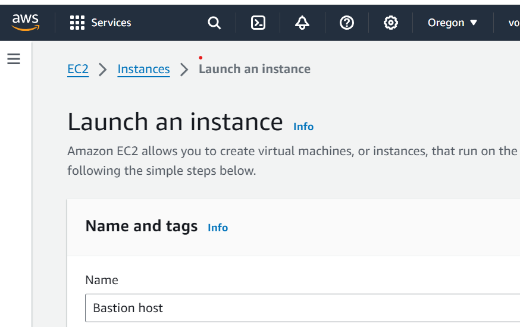

## Launching, Configuring, Monitoring Instance

1) Fistly,  we have to name our instance, AWS creates a key value pair. The key for this pair is Name, and the value is the name we enter for our EC2 instance.
   

2) Secondly, we have to choose an AMI which provides the information required to launch an instance, which is a virtual server in the cloud.

3) Thirdly, we have to select the instance type. Amazon EC2 provides a wide selection of instance types optimized to fit different use cases. Instance types comprise varying combinations of CPU, memory, storage, and networking capacity and give you the flexibility to choose the appropriate mix of resources for your applications. Each instance type includes one or more instance sizes so that you can scale your resources to the requirements of your target workload.

This instance type has 2 virtual CPU and 1 GiB of memory.

4) Forthly, Configuring a key pair. Amazon EC2 uses public–key cryptography to encrypt and decrypt login information. To log in to our instance, we must create a key pair, specify the name of the key pair when we launch the instance, and provide the private key when we connect to the instance.
   

5)Fifthly, Amazon EC2 stores data on a network-attached virtual disk called Amazon Elastic Block Store (Amazon EBS).

6)Sixthly, we configure the details under Advanced details pane.

When you launch an instance in Amazon EC2, you have the option of passing user data to the instance. These commands can be used to perform common automated configuration tasks and even run scripts after the instance starts. 

#!/bin/bash
yum -y install httpd
systemctl enable httpd
systemctl start httpd
echo '<html><h1>Hello From Your Web Server!</h1></html>' > /var/www/html/index.html
The script does the following:

Install an Apache web server (httpd)

Configure the web server to automatically start on boot

Activate the Web server

Create a simple web page

7) Sevethly, we launch the instance

8) Finally we monitor our isntance

