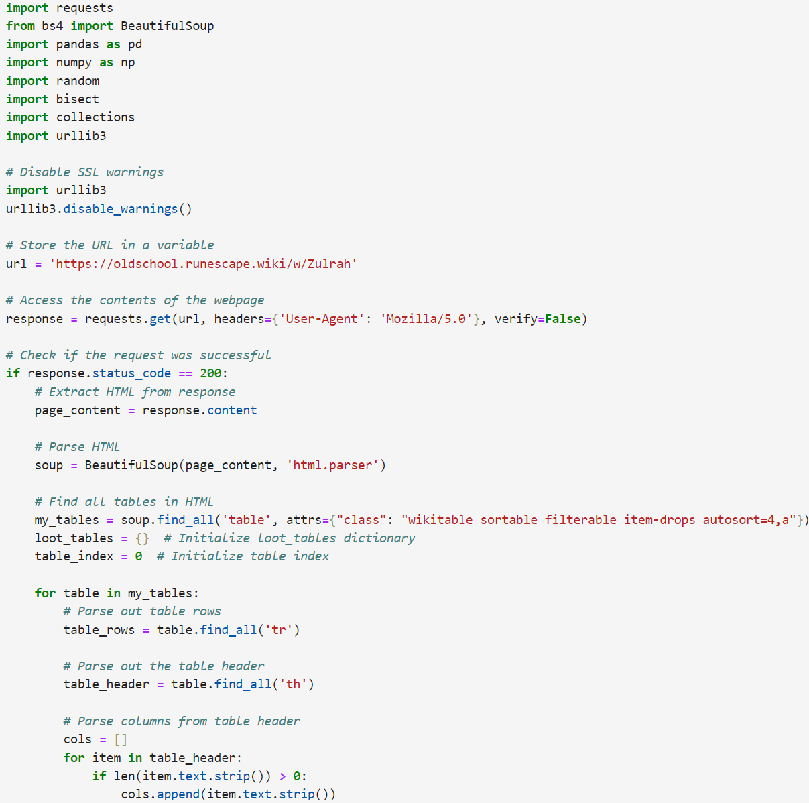
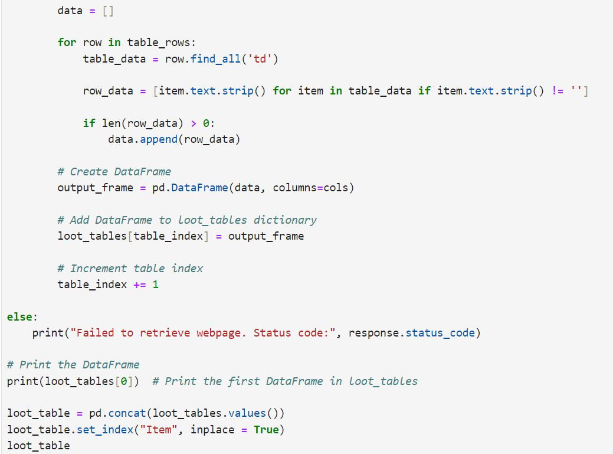
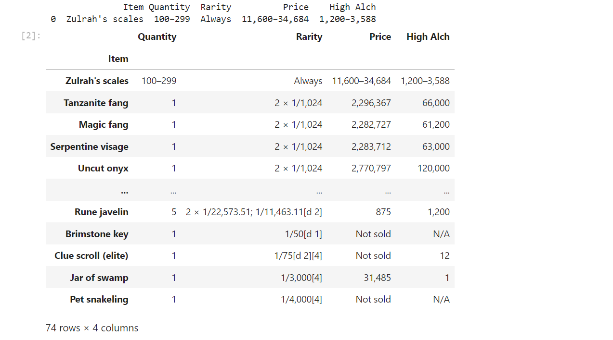

# Zulrah Loot Tables Scraper

This Python script is a web scraping tool designed to extract loot tables from the Zulrah boss encounters on the Old School RuneScape (OSRS) Wiki page. It utilizes the BeautifulSoup and pandas libraries to parse HTML content and organize the data into structured formats.

## Features

- 🕸️ Scrapes Zulrah's loot tables from the OSRS Wiki.
- 📝 Parses HTML content using BeautifulSoup.
- 📊 Organizes loot data into pandas DataFrames.
- 🖨️ Prints loot tables to the console for easy viewing.
- 🔗 Concatenates all loot tables into a single DataFrame.

## Technologies Used

- Python
- BeautifulSoup
- pandas
- requests

## Screenshots

## Output

